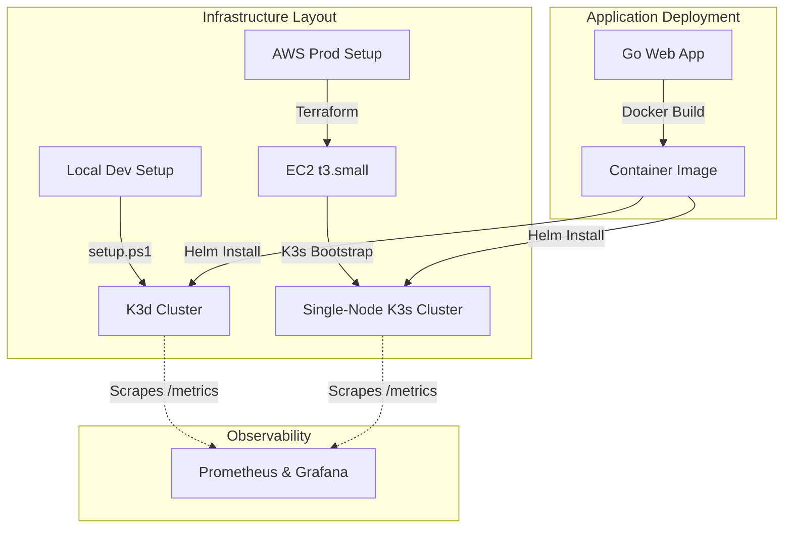

# Self-Hosted Deployment Platform

A premium, cost-effective, and interview-ready self-hosted deployment platform. The project showcases how to package, test, automate, and deploy a Go-based web application with active health checking, Prometheus observability metrics, and structured logging. 

It provides two distinct deployment targets:
1. **Local Development**: Programmatic cluster provisioning via **K3d/K3s** and deployment using **Helm** with ingress routing.
2. **AWS Cloud Production**: A modular **Terraform** architecture deploying a single-node **K3s cluster on a `t3.small` EC2 instance** to demonstrate cloud infrastructure skills while saving cost.



---

## Tech Stack
* **Application**: Go 1.21 (with `slog` JSON logging, custom Prometheus metrics, and native health endpoints)
* **Local Cluster**: K3d & K3s (lightweight Kubernetes in Docker)
* **Cloud Infrastructure**: Terraform & AWS (EC2, VPC, Elastic IP)
* **Package Management**: Helm v3
* **Containerization**: Docker Desktop (Multi-stage alpine build)
* **Observability**: Prometheus metrics (`/metrics`)

---

## Workspace Structure
```text
├── charts/
│   └── self-hosted-app/           # Helm Chart templates for the Go application
│       ├── Chart.yaml
│       ├── values.yaml
│       └── templates/             # Deployments, Services, Ingress, helpers
├── src/
│   ├── app/
│   │   ├── main.go                # Application source code
│   │   └── main_test.go           # Unit and HTTP router tests
│   ├── Dockerfile                 # Hardened, multi-stage builder Dockerfile
│   └── go.mod / go.sum
├── terraform/
│   ├── modules/
│   │   └── aws_k3s/               # AWS K3s cluster module (EC2, VPC, Security Groups)
│   └── environments/
│       ├── aws/                   # Production environment calling AWS module
│       └── local/                 # Local Helm provider mappings
├── k3d-config.yaml                # Port mapping and API server host binding configuration
├── setup.ps1                      # Powershell setup automation script for local dev
└── README.md
```

---

## 1. Local Development Setup

The local setup is automated using a PowerShell script that validates tools, configures a K3d cluster, builds the image, loads it, and installs the Helm chart.

### Prerequisites
* **Docker Desktop** (must be running in WSL2 or Hyper-V mode)
* **Windows PowerShell**

### Step-by-Step Execution

1. Open PowerShell as an administrator or user and execute the automated setup script:
   ```powershell
   powershell -ExecutionPolicy Bypass -File .\setup.ps1
   ```
   *Note: If `helm` or `k3d` is missing, the script will automatically install them using `winget` (or fallback to `choco`) and refresh your session PATH.*

2. Update your local hosts file (`C:\Windows\System32\drivers\etc\hosts`) to map the ingress hostname:
   ```text
   127.0.0.1 self-hosted-app.local
   ```

3. Query the application endpoints in your browser or terminal:
   * **Home page**: `http://self-hosted-app.local:8082/`
   * **Health Check**: `http://self-hosted-app.local:8082/healthz`
   * **Observability Metrics**: `http://self-hosted-app.local:8082/metrics`
   * **Toggle Health State**: `POST/GET` to `http://self-hosted-app.local:8082/toggle-health`

---

## 2. Cloud Environment Setup (AWS)

To demonstrate cloud engineering skills without high managed service costs (like EKS control plane fees), the cloud setup provisions K3s on a single EC2 instance (`t3.small`) using Terraform.

### Prerequisites
* **AWS CLI** configured with your IAM credentials (`aws configure`)
* **Terraform CLI** installed

### Deployment Steps

1. Navigate to the AWS environment folder:
   ```bash
   cd terraform/environments/aws/
   ```

2. Initialize Terraform and download the required provider plugins:
   ```bash
   terraform init
   ```

3. (Optional) Provide your SSH public key. If you have an SSH public key file, you can pass it to variables:
   ```bash
   terraform plan -var="ssh_public_key=ssh-rsa AAAAB3Nza..." -var="key_name=my-deployer-key"
   ```

4. Apply the infrastructure plan:
   ```bash
   terraform apply -var="key_name=my-deployer-key"
   ```

5. Retrieve the Kubeconfig file from the deployed instance (commands are outputted by Terraform):
   ```bash
   # 1. SCP the kubeconfig from the server
   scp -i /path/to/private-key ubuntu@<elastic-ip>:/etc/rancher/k3s/k3s.yaml ./kubeconfig.yaml
   
   # 2. Point kubectl to use the downloaded config
   export KUBECONFIG=./kubeconfig.yaml
   ```

6. Deploy the Helm chart to AWS K3s:
   ```bash
   helm upgrade --install self-hosted-app ../../../charts/self-hosted-app \
     --namespace self-hosted-platform --create-namespace \
     --set ingress.className=traefik
   ```

---

## 3. Testing and Validation

Verification steps can be run locally to ensure code health and template correctness.

### Running Go Unit Tests
Navigate to the `src` directory and run the unit tests (verifying root handlers, health check toggles, and metrics instrumentation):
```bash
cd src
go test ./app/... -v
```

### Linting the Helm Chart
Validate the Helm chart templates for yaml formatting, helm rules, and schema compliance:
```bash
helm lint ./charts/self-hosted-app
```

### Validating Terraform Configurations
Initialize and validate the Terraform code syntax in both local and AWS environments:
```bash
# Validate AWS Environment
terraform -chdir=terraform/environments/aws init -backend=false
terraform -chdir=terraform/environments/aws validate

# Validate Local Environment
terraform -chdir=terraform/environments/local init -backend=false
terraform -chdir=terraform/environments/local validate
```
